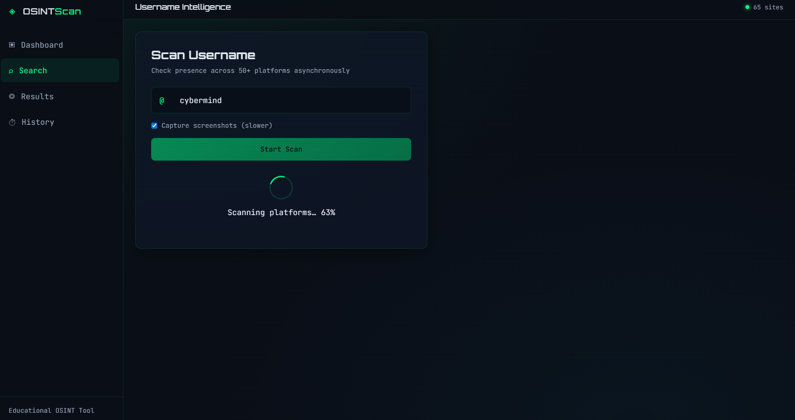
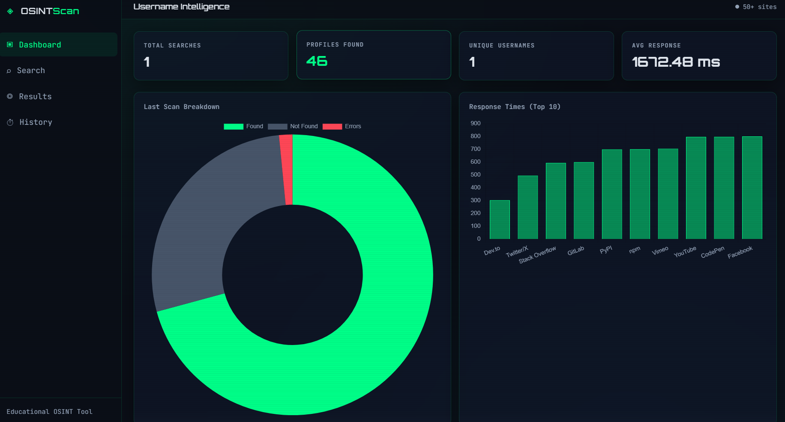
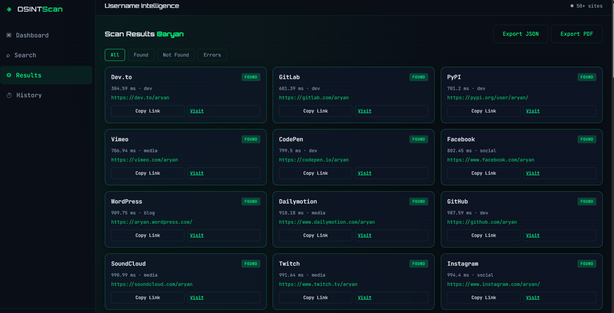

# OSINT Username Finder

A modern full-stack **OSINT (Open Source Intelligence) Username Finder** web application. Enter a username and scan **60+ websites** concurrently to discover where that handle is registered.

Built for learning, CTF practice, and authorized security research. **Only use on usernames you are permitted to investigate.**


---

## 📸 Screenshots

### Search Page


### Dashboard


### Results


## Features

| Feature | Description |
|--------|-------------|
| **Async scanning** | Checks 60+ platforms in parallel using `aiohttp` |
| **Found / Not found / Error** | Clear status per site with response time (ms) |
| **Dark hacker UI** | Glassmorphism, scanlines, JetBrains Mono + Orbitron fonts |
| **Dashboard stats** | Total searches, profiles found, unique usernames, avg response |
| **Charts** | Doughnut (breakdown) + bar chart (response times) via Chart.js |
| **Export** | Download JSON or PDF reports |
| **Screenshots** | Optional Playwright captures for found profiles |
| **Search history** | Stored in SQLite with replay from History tab |
| **Rate limiting** | Per-IP limits via Flask-Limiter |
| **Copy link** | One-click copy profile URLs |
| **Responsive** | Mobile sidebar + grid layout |

---

## Project Structure

```
osint-project/
├── app/                      # Backend application package
│   ├── __init__.py           # Flask app factory (create_app)
│   ├── config.py             # Environment-based configuration
│   ├── extensions.py         # Shared Flask-Limiter instance
│   ├── data/
│   │   └── sites.json        # 60+ platform URL templates & detection rules
│   ├── models/
│   │   └── database.py       # SQLite: searches, results, stats, history
│   ├── routes/
│   │   ├── api.py            # REST API (/api/search, /api/history, …)
│   │   └── main.py           # Serves index.html dashboard
│   └── services/
│       ├── checker.py        # Async username checker (aiohttp)
│       ├── export.py         # JSON & PDF report generation
│       └── screenshot.py     # Playwright screenshot capture
├── static/
│   ├── css/style.css         # Cybersecurity dark theme + glassmorphism
│   └── js/app.js             # Frontend logic, charts, API calls
├── templates/
│   └── index.html            # Single-page dashboard layout
├── instance/                 # SQLite database (created at runtime)
├── screenshots/              # Profile screenshots (runtime)
├── exports/                  # Generated JSON/PDF files (runtime)
├── run.py                    # Local dev server (python run.py)
├── wsgi.py                   # Production WSGI entry (Gunicorn / Render)
├── render.yaml               # Render.com deployment config
├── Procfile                  # Alternative start command for PaaS
├── requirements.txt
├── .env.example
└── README.md
```

### Folder explanations

| Folder / File | Purpose |
|---------------|---------|
| `app/` | All Python backend code in a modular package |
| `app/data/sites.json` | List of websites, URL patterns, and how to detect if a user exists |
| `app/models/` | Database access layer (no ORM — plain SQLite for simplicity) |
| `app/routes/` | HTTP endpoints split into web UI and JSON API |
| `app/services/` | Core business logic (checking, exporting, screenshots) |
| `static/` | CSS and JavaScript served by Flask |
| `templates/` | HTML rendered by Jinja2 |
| `instance/` | Local SQLite file — not committed to git |

---

## Setup Instructions

### 1. Prerequisites

- **Python 3.10+**
- **pip**
- (Optional) **Playwright** for screenshots

### 2. Clone and install

```bash
cd "osint project"
python -m venv venv

# Windows
venv\Scripts\activate

# macOS / Linux
source venv/bin/activate

pip install -r requirements.txt
```

### 3. Environment variables

```bash
copy .env.example .env    # Windows
# cp .env.example .env    # macOS/Linux
```

Edit `.env` if needed (secret key, rate limits, disable screenshots).

### 4. Playwright (optional — for screenshots)

```bash
playwright install chromium
```

Set `SCREENSHOTS_ENABLED=false` in `.env` to skip screenshots and run faster.

### 5. Run the application

```bash
python run.py
```

Open **http://127.0.0.1:5000** in your browser.

---

## Deploy on Render

Render requires your app to listen on **`0.0.0.0`** at the port in the **`PORT`** environment variable. Use **Gunicorn** (not Flask’s dev server).

### Option A — Blueprint (`render.yaml` in repo)

1. Push this repo to GitHub.
2. In Render: **New → Blueprint** → connect the repo.
3. Render uses `render.yaml` automatically:
   - **Build:** `pip install -r requirements.txt`
   - **Start:** `gunicorn --bind 0.0.0.0:$PORT wsgi:app`

### Option B — Manual Web Service

| Setting | Value |
|--------|--------|
| **Build Command** | `pip install -r requirements.txt` |
| **Start Command** | `gunicorn --bind 0.0.0.0:$PORT --workers 2 --threads 4 --timeout 120 wsgi:app` |
| **Environment** | `FLASK_DEBUG=false`, `SCREENSHOTS_ENABLED=false`, `RENDER=true` |

### Why “No open ports detected on 0.0.0.0”?

| Cause | Fix |
|-------|-----|
| Start command is `python run.py` with `HOST=127.0.0.1` | Use **Gunicorn** + `0.0.0.0:$PORT` |
| App crashes before binding | Check Render **Logs** for Python traceback |
| Wrong module | Use `wsgi:app` or `run:app`, not `app.py` |

Local dev is unchanged: `python run.py` → `127.0.0.1:5000`.

---

## Frontend ↔ Backend Connection

```
┌─────────────┐     fetch() REST      ┌──────────────┐
│  app.js     │ ───────────────────►  │  Flask API   │
│  (Browser)  │ ◄───────────────────  │  /api/*      │
└─────────────┘     JSON responses    └──────┬───────┘
                                             │
                    ┌────────────────────────┼────────────────────────┐
                    ▼                        ▼                        ▼
              checker.py              database.py               export.py
              (aiohttp async)         (SQLite)                  (PDF/JSON)
```

1. User submits username in `index.html` / `app.js`.
2. `POST /api/search` sends `{ username, screenshots }`.
3. Flask runs `checker.check_username()` → async HTTP to all sites in `sites.json`.
4. Optional screenshots via Playwright; results saved to SQLite.
5. JSON response rendered as cards; Chart.js updates dashboard charts.
6. Export buttons call `POST /api/export/json` or `/api/export/pdf` and download files.

---

## How Async Requests Work

Traditional scanning checks sites **one by one** (slow). This app uses **async I/O**:

1. `asyncio` + `aiohttp` open many HTTP connections at once.
2. A **semaphore** limits concurrency (`MAX_CONCURRENT_REQUESTS`, default 25) to avoid overwhelming networks.
3. Each site check is a **coroutine**; `asyncio.gather()` waits for all to finish.
4. Flask calls `asyncio.run()` from synchronous route handlers.

Example flow for username `johndoe`:

```
Site 1 ──┐
Site 2 ──┼──► [Semaphore pool] ──► Results in ~5–15 seconds
...      │
Site 60 ─┘
```

---

## REST API Reference

| Method | Endpoint | Description |
|--------|----------|-------------|
| GET | `/api/health` | Health check |
| GET | `/api/stats` | Dashboard statistics |
| GET | `/api/history` | Recent searches |
| GET | `/api/history/<id>` | Single search + results |
| POST | `/api/search` | Run username scan (rate limited) |
| POST | `/api/export/json` | Export JSON report |
| POST | `/api/export/pdf` | Export PDF report |
| GET | `/api/export/download/<file>` | Download export file |
| GET | `/api/sites/count` | Number of configured sites |

### Example: Search

```bash
curl -X POST http://127.0.0.1:5000/api/search \
  -H "Content-Type: application/json" \
  -d "{\"username\": \"github\", \"screenshots\": false}"
```

---

## Detection Methods (sites.json)

Each platform entry supports:

| `detect` | How it works |
|----------|----------------|
| `status_code` | HTTP 200 = found, 404 = not found |
| `message` | Search response body for text markers |
| `url` | Check final URL after redirects |

**Note:** Many sites block bots, use CAPTCHAs, or change behavior. Results are **heuristic** — verify manually before drawing conclusions.

---

## Major Functions (Backend)

| Function | File | Role |
|----------|------|------|
| `create_app()` | `app/__init__.py` | Builds Flask app, DB, limiter, blueprints |
| `check_username_async()` | `services/checker.py` | Concurrent scan across all sites |
| `_check_one()` | `services/checker.py` | Single site HTTP check + timing |
| `save_search()` | `models/database.py` | Persist search + results to SQLite |
| `capture_screenshots()` | `services/screenshot.py` | Playwright PNG capture |
| `export_json()` / `export_pdf()` | `services/export.py` | Generate downloadable reports |
| `search()` | `routes/api.py` | Main API endpoint orchestrating the flow |

---

## Legal & Ethics

- Use only for **authorized** research, your own accounts, or educational labs.
- Respect website **Terms of Service** and **rate limits**.
- Do not use this tool for harassment, stalking, or illegal access.
- The authors provide this software **as-is** with no warranty.

---

## Troubleshooting

| Issue | Fix |
|-------|-----|
| `ModuleNotFoundError` | Activate venv and `pip install -r requirements.txt` |
| Rate limit 429 | Wait a minute or adjust `RATE_LIMIT_SEARCH` in `.env` |
| Screenshots fail | Run `playwright install chromium` or disable screenshots |
| Many false positives | Sites often return 200 for all pages — verify links manually |
| SSL errors | Some sites use strict SSL; checker uses `ssl=False` for compatibility |

---

## License

MIT — free for educational and personal use.
